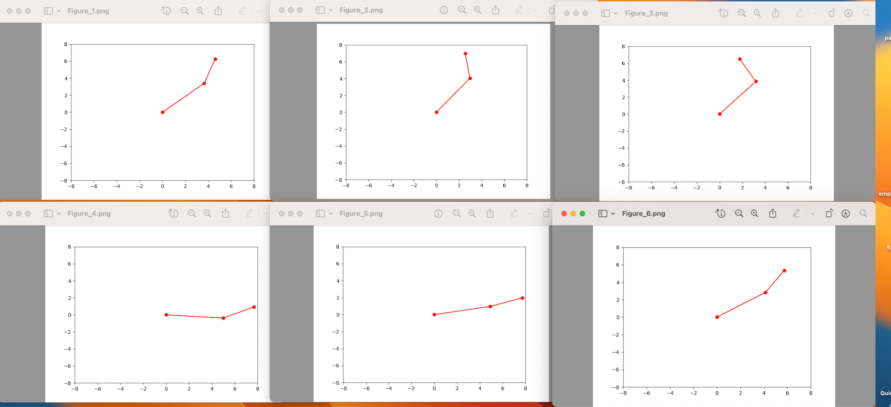
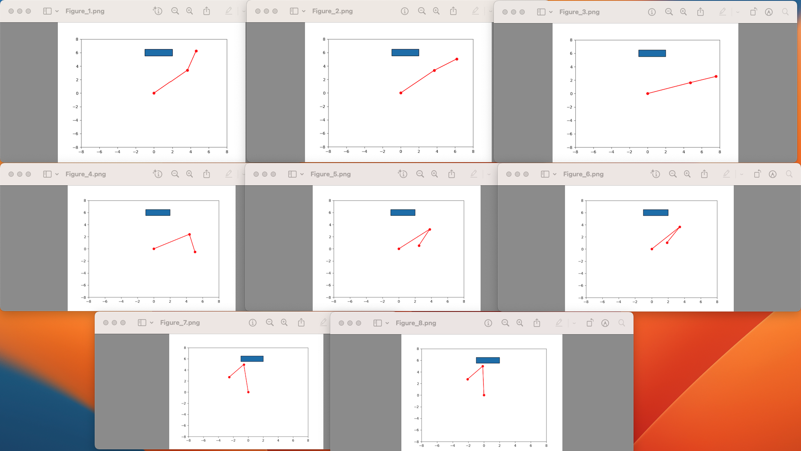
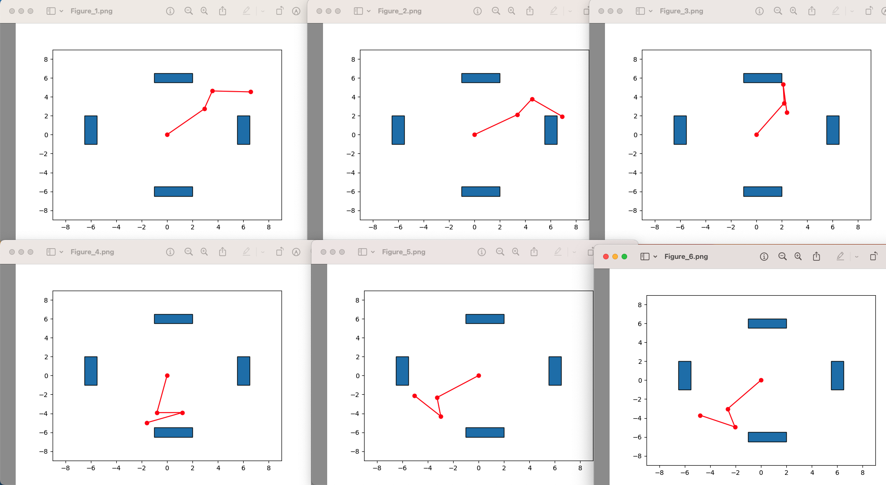
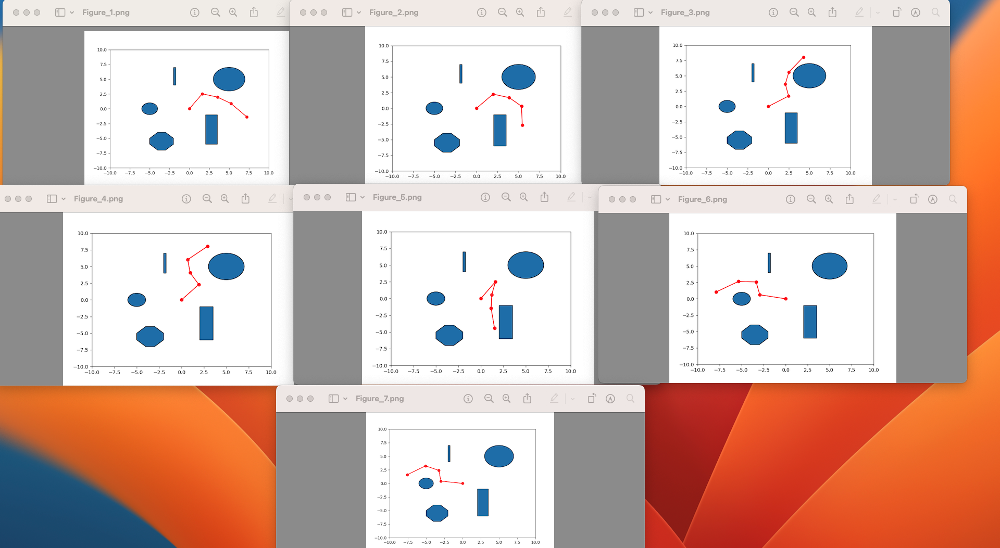
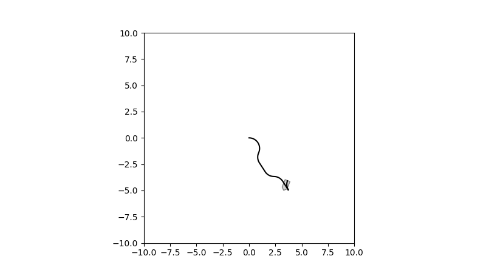
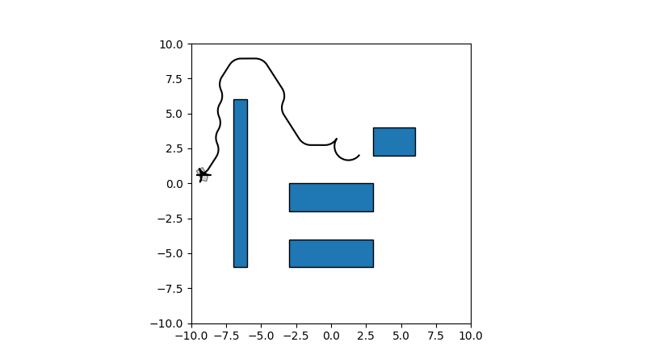
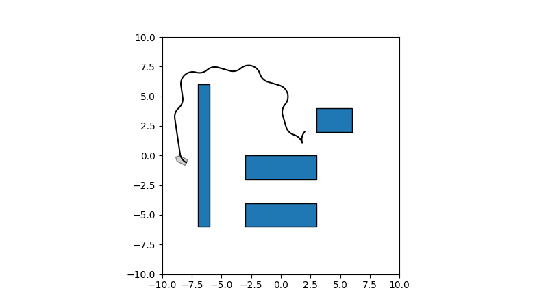

# Robot Arm Motion and Car Motion Planning

### Ben Williams '25 - November 2023

## Workspace

In the workspace, we take a list of joint-lengths (in sequential order) and a list of shapely polygons or other shapes as parameters. 

The Workspace object uses these joint lengths and obstacles for its other methods, where you input a list of angles for each of the joints.

### Get Joints Coordinates

This takes a list of angles representing the angle of each joint, and returns a list of (x, y) coordinates for where each joint is. This function is used for helping determine collisions with obstacles in `is_collision_state`.

We begin with the point (0,0) representing the base of the first joint. Then, for any given joint, to calculate its x coordinate multiply its joint length by the cosine of the sum of all the previous joints angles as well as its own (the "cumulative" angle). Then, add the previous joint's x coordinate to get the final value.

The y coordinate is the joint length multiplied by the sin of the cumulative angle, then adding the previous joint's y coordinate.

### Is Collision State

Given a list of angles, we first get the coordinates of all the joints from `get_joints_coordinates`, and then create a shapely LineString from them - representing the robot arms. We can check if this LineString intersects with any of the obstacles. If it does, we return `True`, otherwise `False`.

### Graphics Workspace

Given a list of angles, we can illustrate the entire workspace in the x, y plane using Matplotlib. The robot arms are drawn in red, while the obstacles are drawn in blue. The range of coordinates is defined to be +/- the maximum length (straightened out) robot arm on both the x and y axes. That way, the base of the arm is in the center and the axes never change when the robot arm moves.

## Probabilistic Roadmap (PRM)

The ProbabilisticRoadmap object takes a Workspace object and an integer `num_vertices` as parameters. With this, we can build a PRM in the c-space (angular space) representation of the workspace to use for the robot motion planning.

In the instantiation, we create our vertices using `instantiate_random_vertices` and our graph using `create_near_neighbor_graph`. 

### Instantiate Random Vertices

In c-space, the number of dimensions is equal to the number of joints in the workspace, because each joint has its own respective angle. The range of each value in the point is between 0 and 2pi, and can wrap around. So, for a `d` dimensional point, we generate `d` random values between 0 and 2pi, check if that is a valid point using the workspace's `is_collision_state`, and if it is valid we add it to the list. We do this until we have `num_vertices` valid points, and return them.

## Create Near-Neighbor Graph

We represent the graph using a dictionary for the data structure. We take an optional integer parameter `degree`, but otherwise we have the degree of the vertices set to `ln(num_vertices)`, since we need a logarithmic degree to be able to have consistent success (Professor Balkcom mentioned this in class - but I cannot find a paper for this). 

Then, we build the graph by getting the `degree` nearest valid neighbors using `get_k_nearest_neighbors` for each vertex and adding vertex --> neighbors relationship to the dictionary.

## Get k nearest neighbors

Given a vertex and an integer `k`, we return a list of the `k` nearest valid neighbors if we can find `k` of them. 

We loop over every vertex and check its distance using the `angular_euclidean_distance` function. If the distance is within the smallest five that we have seen, we interpolate between the two points looking for collisions on the edge using the `collision_interpolation` function. The interpolation is done using an arbitrary `5` points - but can be done with any amount of points. More interpolation is slow though.

We finally return the list of the `k` nearest (hopefully) valid neighbors. There is still a chance that they are not valid, but the interpolation should reduce the chance of that occurring.

## Collision Interpolation

We take two vertices and an integer `num_interpolation_points` steps as parameter. and find the difference between each component of the point, and divide it by `num_interpolation_points + 1`. We use these values to find all of the `num_interpolation_points` points inbetween the two vertices, evenly spaced out. If any of those have a collision, we return `True`, otherwise, we return `False`.

### Angular Euclidean Distance

This short function is instrumental to much of the math done in the PRM. It takes two vertices as parameter, and returns the "Euclidean" distance between the two **accounting for the fact that we can wrap from 0 to 2pi and vice versa**. 

We use the standard euclidean distance formula, except rather than always just adding the difference-squared between two points, we have use the minimum of the difference squared and (2pi - difference) squared for each angle in the vertex. We return the square root of the sum of these values, just like in the normal euclidean distance formula.

Note that small angular changes here can represent x, y movements in the actual workspace. If we change the first joint's angle by a bit, the whole robot arm moves a lot. This function **does not account** for this fact, but rather is representing the angle rotated for each joint.

### Solving for a Path

To begin, `find_path_bfs` takes both a start and a goal point (ie - two lists of angles) as parameters. It then finds the nearest vertex on the graph to the start point: `start_neighbor`, and the nearest vertex on the graph to the end point: `end_neighbor`. We use a simple BFS in order to find the path from the `start_neighbor` and to the `end_neighbor`, and adds the start and goal points onto the both ends of the path, and returns it. If a path is not found, `find_path_bfs` will return `None`.

## Results

First, we rotate a two arm robot clockwise just slightly. This illustrates that the `angular_euclidean_distance` is working as intended - and that we do not try to rotate all the way counter-clockwise. We are rotating from `(0.75, 0.5)` in radians to `(0.6, 0.4)` using a PRM with 200 vertices:



Then, we rotate a two arm robot clockwise while avoiding an obstacle. This illustrates how the robot arm can start to avoid obstacles. We are rotating from the angles `(0.75, 0.5)` to `(1.6, 2.4)` using a PRM with 200 vertices:



Next, we rotate a three arm robot around some boxes. This illustrates a more complex map and robot arm but one that still has simple shapes. We are rotating from the angles `(0.75, 0.5, 5)` to `(4, 1, 4)` using a PRM with 1,000 vertices:



Finally, we rotate a four arm robot around a complex map. The map has a hexagon, a thin rectangle (to try to trip up the near neighbors), a box, and two circles. We are rotating from the angles `(1, 5, 6, 6)` to `(3, 5, 1, 1)` using a PRM with 2,000 vertices:



## Discussion - PRM

### Interpolation and Speed

While interpolating between the near-neighbors will make the PRM more robust, it significantly slows down the algorithm. There is also not a well-defined metric as to how many points should be in the interpolation. We use `5` points arbitrarily. At a certain point, it could potentially be worth just creating a shapely Line or LineString between the two points and checking for collisions directly - as it could be easily implemented in the workspace. Nevertheless, while having any interpolation is far more robust than just *hoping* that an edge has no collisions, it still does not guarantee good paths.

### Degree of the Vertices - how many near neighbors?

To experiment, rather than using the default `ln(num_vertices)` as the degree of the graph, I tried to use a degree of `3` in the four arm complex PRM. Overall, it caused the algorithm to struggle. One time, it gave a significantly longer (but still valid) path, and another time it was unable to find a solution at all. 

There may be a balance between the number of vertices in the graph (which is not that hard to compute, but takes space) and the degree of each vertex (harder to compute, also takes space). If we had more vertices, the algorithm would be more likely to find a solution, but fewer vertices with more edges may give shorter paths **though the interpolation becomes more important with fewer vertices**.

## Car Motion Planning - Rapidly Exploring Random Tree (RRT)

We use an RRT in order to plan the path of a car from a start location and orientation to an end location and orientation. Using the RRT, we can get the car very close to the end goal while avoiding obstacles along the way. The majority of the planar movement code was provided for me, but the RRT and the CarWorkspace are mine.

### Car Workspace

Just like the robot arm, we need to have a clear workspace to represent the space that the car is driving in. A CarWorkspace object takes a list of obstacles (shapely shapes) as parameters, and has two functions. The first, `is_car_collision` takes a `CarShapes` object as parameter and returns whether the car is hitting an obstacle. However, this is expensive and requires keeping track of an actual car object during the RRT creation. Therefore, there is a second function `is_collision_simplified` that just takes x, y coordinates as parameters and searches around a radius of that point equivalent to the length of the car. That way, it takes less computation and will only give false-positive collisions.

### RRT and RRTVertex

The RRT itself takes many parameters. It takes the car_workspace, the start location, the range of the space, the maximum number of vertices, and optionally the goal location as parameters.

#### RRT Vertex

Each vertex on the tree represents a location and an orientation, but also needs to have references to the parent node and how the parent node got to this new state. This allows for easy backtracking up the tree when given a query for the goal.

The RRTVertex has two functions: `euclidean_distance` and `expand_tree`. The first is obvious - it returns the euclidean distance between this vertex's location and another point. The second is slightly more complicated - it tries to make all 6 possible moves from that vertex's location, and if they are not already in the tree and do not hit an obstacle (using `is_collision_simplified` as mentioned above). 

#### Creating the Tree

In RRT, the `create_tree` method either runs until the max number of vertices have been created, or, if a goal location was provided, that we find a location very close to the goal. It looks at a random point within the range provided, and expands the vertex (or vertices if there are ties) that are closest to the random point. 

If a goal has been provided, we have a 1% chance of trying to expand out towards the goal. This allows for greedy search, but if this value is too large then we would likely not expand far enough around obstacles to get the actual path to the goal. This 1% value was chosen from this source: https://lavalle.pl/planning/node236.html (link from professor Balkcom's slides). 

#### Path and Solution

Given a goal, we can easily find a path of moves to the vertex closest to it. We do this by using the `parent` and `parent_move` attributes of all the RRTVertices. `get_path` returns this path of moves. It also prefers picking the closest point with the best orientation if there are ties, but it prioritizes location over orientation.

However, the PlanarTrajectory object wants a more concise representation of the moves - it wants a control sequence alongside the durations for each control. `get_solution` takes a goal, finds the path, and then converts that path into the format for the PlanarTrajectory.

### Results

I only created two maps - one without obstacles and one with several - to illustrate the RRT. With it, we are able to see how the car avoids obstacles to get to a goal location, as well as the drawbacks of allowing the tree to expand for too long.

In this first example, we are moving the car from `(0, 0, 0)` (x = 0, y = 0, theta = 0) to `(3, -3, 1.5)`. Here is the path when we set `max_vertices` to 1,000 and **do not** provide a goal to the RRT - just query for it after the fact:



Fortunately, in this easy situation, the car is easily able to get to the goal. Note, however, that the orientation is not correct - more steering would need to be done in order to get to the exact right orientation.

Now, we consider two situations in an obstacle ridden workspace. The first is where we **do not** provide the goal to the RRT, and there is no greedy searching or early stopping. There is a max of 20,000 vertices:



As you can see, the path gets quite convoluted at the end, as there are many vertices near each other as the tree expanded a lot in that small area. 

Here, we provide the goal to the RRT:



In this case, there end up only being 2,337 vertices in the tree at the end since it was able to break out early.

### RRT Discussion

By letting the tree expand *too* much, we end up with more convoluted / longer paths that are still correct. However, if we want to query for more than one goal, then it is best to let the tree expand out everywhere evenly - and not greedily search towards one single goal. 

It would be relatively easy to expand the control set that the RRT uses. Currently, it is just using the `control_rs` from the `planar_trajectory.py` in order to keep everything consistent with the lectures and the examples. 

#### Discretize the movements

The biggest problem with the RRT is that the simulated moves on the tree do not quite match up with the actual transformations done to the car. This is because the change of the angle of the car is done continuously, while we are not computing a continuous change of the car angle while expanding the tree.

We approximate the continuous angle in the `expand_tree` function by setting `avg_angle = self.state[2] + (move[2] / 2)`. This takes into account the angle at the beginning of the movement and at the end of the movement, and since the angle differences are at most 1 with the `control_rs` that we use - the errors will not be too large, but will compound over time.

For instance, in one example, the final vertex on the path has the following attributes:
```
Vertex at location: (-8.087889349547343, -0.45317587585729924) with angle 1
```

However, the car configuration at the end of the journey (31 different moves) is the following:
```
Car final config (-7.804126557981665, -0.4182824175339692, 0.9999999999999998)
```

Fortunately, these are close - but we can see a drift in the `x` direction of about `0.25`. On a larger map, this would likely become more pronounced. One fix for this would potentially be to take the average value of the movement function (using calculus), but that would take a lot of extra computation, and it may be better to use the matrices from PlanarTrajectory instead. This movement approximation would be especially problematic in narrow corridors where this slight drift will cause the car to run into obstacles.

Some animations of other tests can be found in the animations folder.

## Other Sources

I used this link for finding out how to plot the polygons:
https://stackoverflow.com/questions/55522395/how-do-i-plot-shapely-polygons-and-objects-using-matplotlib